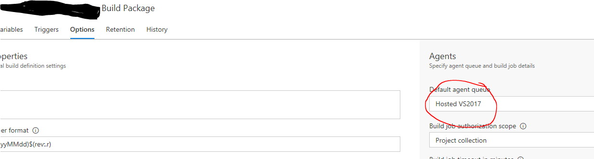
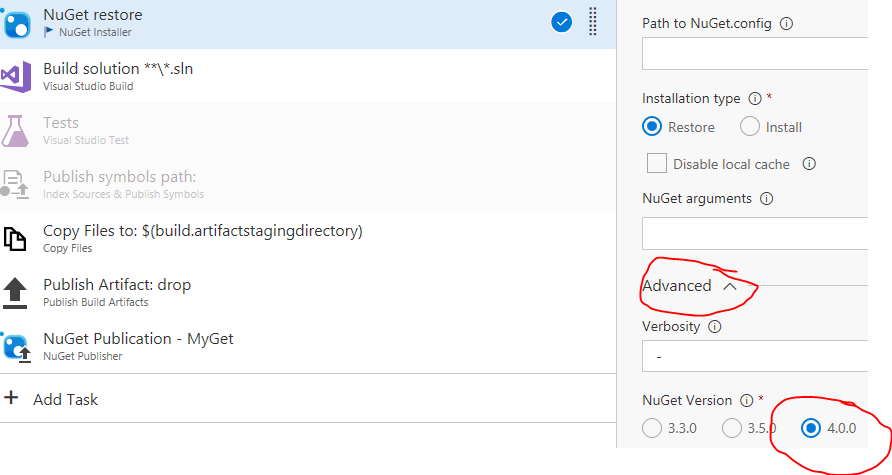

# VSTS – Construire une librairie .NET Standard avec VS2017

Depuis la sortie de VS2017, nous avons la possibilité de développer plus facilement des librairies .NET Standard (ce qui remplace les PCL désormais).

Si on a l'intention de faire de l'intégration continue avec VSTS (Visual Studio Team Services) pour générer notre librairie (pour la tester ou l'empaqueter par exemple), on fait face à différentes erreurs qui provoque un échec de la compilation.

Pas de panique, Yanos est là ;)

<!--more-->

## Modification de l'agent

La première erreur qui à lieu c'est que le système de build ne reconnaît pas notre solution au format VS2017.

En effet il s'avère que VSTS propose un agent spécifique pour les solutions compilées avec VS2017. Cet agent ce nomme "Hosted VS2017", et il faut modifier la définition de build pour lui indiquer l'agent à utiliser.

Dans la définition de votre build, ouvrir l'onglet "Options", et dans la liste "Default agent queue" sélectionner "Hosted VS2017".

## Modifier la version de Nuget

Une fois fait, nous rencontrons une seconde erreur: il y a un problème avec les packages restaurés qui n'ont pas l'air de correspondre à ce qui est définis dans notre "package.conf".

Cela est du au fait que les librairies .NET Standard utilise les protocoles Nuget V4.0. Par défaut les tâches VSTS utilisent la version "3.3.0".

Donc pour corriger ce problème il faut demander à toutes les tâches qui utilise Nuget, d'utiliser sa version "4.0", pour cela dans la liste des tâches sélectionner chacune des tâches "Nuget":
- Ouvrir le panneau "Advanced"
- Dans "Nuget Version" sélectionner "4.0"

Et c'est tout.

A bientôt,

Yanos

